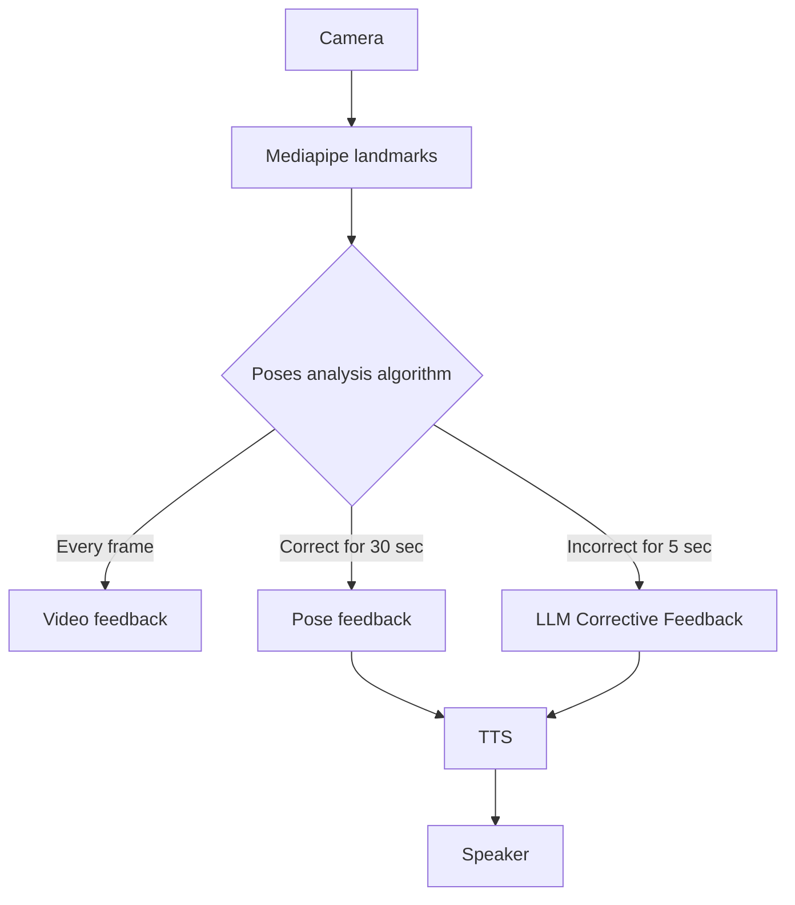

# Marty, your new personal Yoga Coach!

[View our Draft Video Demo on Youtube](https://youtu.be/3Od9CCHt7Os)

# Marty's role as a robot

- [x] Embodiment
- [ ] 
- [x] Pose demonstration
- [x] Moving the body part to communicate corrections (non verbal)
  - [x] Arms (jokes on elbow)
  - [x] Legs (careful to keep balance)
  - [ ] Ankles (twist left/right)
  - [ ] Back (bend forward/backward)
- [x] Showing pose progresion with number of LEDs
- [x] Showing correctness with LED colors (red/orange/green)

- [ ] Bonus: Selecting a number by turning eyes or arm and showing the feedback with number of LEDs on eyes

# Marty's role as a coach
- [x] Present himself at the beginning
- [ ] Bonus: Select a voice for Marty
- [ ] Bonus: Personalized user (tired, improving fast, remembering user's name)

# Global architecture

## Using Mediapipe
- [x] Getting landmarks from video feed.
- [x] Bigger screen
- [ ] Search for better mediapipe model

## Poses analysis algorithm
Video feedback
- [x] Defining target poses with thresholds
- [x] Analyzing incoming landmarks against target poses
- [x] Coloring landmarks and joints
- [x] Déclencher corrective feedback when incorrect for more than 5 seconds
- [x] Déclencher long feedback when correct for more than 30 seconds
- [ ] Showing expected and current pose overlayed on video
- [x] Bonus: Using 3D landmarks

## Corrective LLM Feedback
- [x] Use non verbal marty communication
- [x] Bonus: Different prompt regarding our prior situation analysis (e.g. very high error)
- [x] Prerecord voice and marty poses for common corrections (e.g. arms too low, back not straight) -> Llama 3.2 is fast enough
- [ ] It cancels corrective feedback only if body parts present in the sentence are not present anymore in the mediapipe output when the voice is ready
- [ ] Don't show text while voice is generating, show the hole thing at one (only for corrective feedback)

## Camera
- [x] Use laptop camera
- [x] Use phone large angle camera connecting via wifi to have video feedback next to Marty

## LLM Feedback
- [ ] Prompt engineering
- [ ] Give context to the LLM about previous conversations
- [ ] Poses description
- [ ] Bonus: {user name} {number of correction done} {time spent}

## TTS
- [x] TTS macos instant
- [x] Kokoro high quality low latency TTS
- [x] Bonus: Emotional TTS like CosyVoice -> Way too slow to run it at runtime

# Code structure
- [ ] use window.py for window operations

# Run locally
Use the environment variable `HF_HUB_OFFLINE=1` to run the code without internet connection.

# Going further

- [ ] Explore this setup for exercices at home (planks, push-ups, squats, etc.)
  - It could evaluate planks as a static pose and upper part of push-ups and bottom part of squats as static poses. It could also count the number of repetitions.

# Optimizations

- [ ] "3, 2, 1, hold" should show landmarks while saying it, not after.

Using 25 sec to verify a pose and using the last 5 to start generating a thoughtful feedback (thinking mode).

While he's speaking, we can capture the 5 last seconds to see if we need to say something about it or not.

Bonus: Générer une séance de yoga personalisée et adaptées.

Joint: L-Elbow, Angle: 156
Joint: R-Elbow, Angle: 170
Joint: L-Knee, Angle: 148
Joint: R-Knee, Angle: 132
Joint: L-Hip, Angle: 168
Joint: R-Hip, Angle: 139
Joint: L-Elbow, Angle: 157
Joint: R-Elbow, Angle: 168
Joint: L-Knee, Angle: 144
Joint: R-Knee, Angle: 128
Joint: L-Hip, Angle: 167
Joint: R-Hip, Angle: 139

## Setup
https://github.com/thewh1teagle/kokoro-onnx/releases

## Bonus

Make marty more alive by mooving arms or legs when it is making a correctiv feedback

# Calendar Todo

Monday
- [x] Send Email about
  - [x] Title -> Coached Yoga: Bridging the Gap between Video and Human Instructors with Low-Cost Social Robotics
  - [x] Where should we submit the video?

- [x] Reliable pose progress with LEDs (simple)

Tuesday
  - [x] Apply Feedback on robot design
  - [x] Redo abstract to add Video and Human Coaching
  - [x] Remove some Future Work with what has been done
  - [x] citation ollama
  - [x] citation kokoro
  - [ ] Mise en forme du papier
    - [ ] descriptions images
    - [ ] images de la page de garde
    - [ ] CCS Concepts
  - [x] evaluation apprehension est-ce que le papier de recherche dit bien que les robot en créent moins que les humains
  - [x] citations 2025->2026
  - [x] Add date to all website
  - [x] citation llama 3.1 et 3.2
  - [x] Is citation still relevant? (we removed LLM and TTS from the sentence) Adaptive feedback mechanisms and user profile memory could strengthen long-term companionship and personalisation \cite{shen2025artificial, kraus2022social}.

Wednesday
  - [x] Merge code
  - [x] Add llama3.1 and llama3.2
  - [ ] add \Description{...} to all pictures in the paper
  - [ ] add \includegraphics{...} or alt="{...}"
  - [x] Revoir Conference/Publisher-Specific Requirements trop fatigué
  - [x] Superposer les poses attendues et actuelles
  - [ ] LLM Poses Description and HowTo to review
  - [ ] Marty Warrior pose to improve
  - [ ] Test memory (response quality, do we still have repetition of Welcome? Does it take a longer time to generate?)
  - [ ] Marty has to show more emotion with LEDs
  - [x] Add image of a human doing the pose to the window
  - [x] Show desired mediapipe pose on window or on the photo
  - [ ] Take new pictures for camera ready paper:
    - [ ] Warrior2 (arm back and front)
    - [ ] Chair (arms up)
    - [ ] Screenshot of Video with mediapipe overlay and subtitles
  - [ ] Record video
  - [ ] Montage video
  - [ ] Submit paper and video
