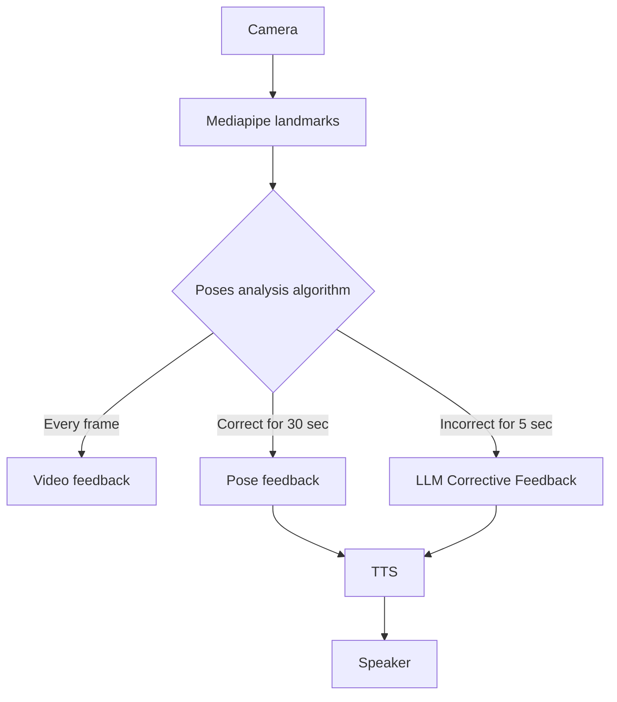

# Marty: Your Personal AI Yoga Coach 🧘‍♂️🤖
## Bridging the gap between video tutorials and human instructors with low-cost social robotics.

🎥 [Watch the Demo Video](https://www.youtube.com/watch?v=3Od9CCHt7Os)
## 📖 Overview

Marty is an embodied Yoga Coach designed to provide real-time, interactive feedback during your yoga practice. By combining computer vision (MediaPipe) with Large Language Models (Llama 3 via Ollama) and high-quality Text-to-Speech (Kokoro), Marty observes your poses and offers corrective advice through movement, LED indicators, and voice.
### Key Features

- **Embodiment**: Marty demonstrates poses and moves specific body parts (arms, legs) to communicate corrections non-verbally.

- **Visual Feedback**: Real-time LED indicators show pose progression (filling up) and correctness (Red/Orange/Green).
- **Computer Vision**: Uses MediaPipe to track 3D landmarks and analyze joint angles against target yoga poses.

- **Intelligent Coaching**:

    - **Instant Feedback**: Visual cues and non-verbal robot movements.

    - **Corrective Feedback**: If a pose is incorrect for >5 seconds, LLM generates specific advice.

    - **Positive Reinforcement**: Encouragement when a pose is held correctly for >30 seconds.

    - **Privacy First**: Runs completely locally using offline models.

## 🏗 Architecture

The system processes video feed to analyze poses, triggering either immediate robotic feedback or generating synthesized verbal guidance via LLM/TTS.
Code snippet



## ⚙️ Prerequisites

- Python: Version 3.10 (Latest)

- Ollama: Installed and running.

- Hardware:

    - Webcam (Laptop or external).

    - Marty the Robot (optional for software testing, required for embodiment).

## 📥 Installation

We recommend using uv for fast and reliable dependency management.

**1. Clone the repository**
```Bash

git clone git@github.com:MyApero/marty-yoga-HRI2026.git
cd marty-yoga-HRI2026
```
**2. Set up the Python Environment**

Create a virtual environment anf use `uv` (ensure you are using Python 3.10):
```Bash
python3.10 -m venv venv
```
```Bash
# Activate the environment
# On macOS/Linux:
source .venv/bin/activate
```
```Bash
# Create virtual environment
pip install uv
```


**3. Install Dependencies**
```Bash
uv pip install -r requirements.txt
```
**4. Download Required Models**

You must place the following model files in the root directory (or your configured models folder):

- **MediaPipe Model**:

    - Download `pose_landmarker_full.task` from Google MediaPipe solutions.

- **Kokoro TTS Models**:

    - Download `kokoro-v1.0.onnx` and `voices-v1.0.bin` from [kokoro-onnx releases](https://github.com/thewh1teagle/kokoro-onnx/releases).

- **Ollama Models**:

    - Pull the required Llama models:

```Bash

ollama pull llama3.1
ollama pull llama3.2
```

## 🚀 Usage

**1. Start Ollama**

Ensure the Ollama server is running in the background:
```Bash
ollama serve
```

**2. Run the Coach**

Launch the main application:
```Bash
python main.py
```

Or in offline Mode

```Bash

# Using the script
./run_offline.sh

# OR manually
export HF_HUB_OFFLINE=1
python main.py
```

**3. Start the Session**

Once the video window appears, press the `d` key on your keyboard to start the session and enable pose analysis.

## 🛠 Configuration & Custom Poses

You can customize the experience by editing the various `.toml` configuration files found in the project directory.

**Adding New Poses**: Currently, adding new yoga poses requires manual code adjustments:

- Explore the `poses/ folder` to understand the structure and requirements for defining a pose class.

- Create your new pose definition following that structure.

- Open `main.py`, import your new pose, and manually register it within the main execution loop.

## 🧠 Technical Details

- **Pose Analysis**: Calculates joint angles (Elbows, Knees, Hips) and compares them against defined thresholds for specific yoga poses.

- **LLM Integration**: Uses Llama 3.2 (optimized for speed) to generate natural language corrections based on specific limb errors detected by the vision system.

- **TTS**: Uses Kokoro (ONNX) for high-quality, low-latency speech synthesis.

## 🤝 Contributing

This project is a research prototype. Contributions to improve pose detection accuracy or add new yoga poses are welcome!

## 📄 License
**GNU GENERAL PUBLIC LICENSE**

