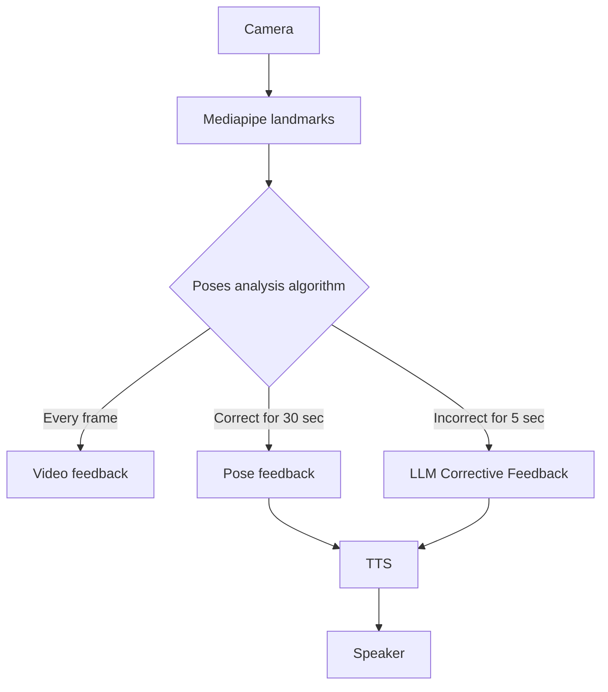

# Marty's role as a robot

- [x] Embodiment
- [ ] 
- [ ] Pose demonstration
- [ ] Moving the body part to communicate corrections (non verbal)
  - [ ] Arms (jokes on elbow)
  - [ ] Legs (careful to keep balance)
  - [ ] Back (bend forward/backward)
  - [ ] Ankles (twist left/right)

- [ ] Bonus: Selecting a number by turning eyes or arm and showing the feedback with number of LEDs on eyes

# Marty's role as a coach
- [ ] Present himself at the beginning
- [ ] Bonus: Select a voice for Marty
- [ ] Bonus: Personalized user (tired, improving fast, remembering user's name)

# Global architecture

## Using Mediapipe
- [x] Getting landmarks from video feed.
- [ ] 
- [ ] Bigger screen

## Poses analysis algorithm
Video feedback
- [x] Defining target poses with thresholds
- [x] Analyzing incoming landmarks against target poses
- [x] Coloring landmarks and joints
- [ ] Déclencher corrective feedback when incorrect for more than 5 seconds
- [x] Déclencher long feedback when correct for more than 30 seconds
- [ ] Bonus: Using 3D landmarks

## Corrective LLM Feedback
- [x] Use non verbal marty communication
- [ ] Bonus: Different prompt regarding our prior situation analysis (e.g. very high error)
- [ ] Prerecord voice and marty poses for common corrections (e.g. arms too low, back not straight)

## Camera
- [x] Use laptop camera
- [ ] Use phone large angle camera connecting via wifi to have video feedback next to Marty

## LLM Feedback
- [ ] Prompt engineering
- [ ] Poses description
- [ ] Bonus: {user name} {number of correction done} {time spent}

## TTS
- [x] TTS macos instant
- [x] Kokoro high quality low latency TTS
- [x] Bonus: Emotional TTS like CosyVoice -> Way too slow to run it at runtime

# Code structure
- [ ] use window.py for window operations

# Run locally
Use the environment variable `HF_HUB_OFFLINE=1` to run the code without internet connection.

# Going further

- [ ] Explore this setup for exercices at home (planks, push-ups, squats, etc.)
  - It could evaluate planks as a static pose and upper part of push-ups and bottom part of squats as static poses. It could also count the number of repetitions.

# Optimizations

Using 25 sec to verify a pose and using the last 5 to start generating a thoughtful feedback (thinking mode).

While he's speaking, we can capture the 5 last seconds to see if we need to say something about it or not.

Bonus: Générer une séance de yoga personalisée et adaptées.

Joint: L-Elbow, Angle: 156
Joint: R-Elbow, Angle: 170
Joint: L-Knee, Angle: 148
Joint: R-Knee, Angle: 132
Joint: L-Hip, Angle: 168
Joint: R-Hip, Angle: 139
Joint: L-Elbow, Angle: 157
Joint: R-Elbow, Angle: 168
Joint: L-Knee, Angle: 144
Joint: R-Knee, Angle: 128
Joint: L-Hip, Angle: 167
Joint: R-Hip, Angle: 139

## Setup
https://github.com/thewh1teagle/kokoro-onnx/releases

